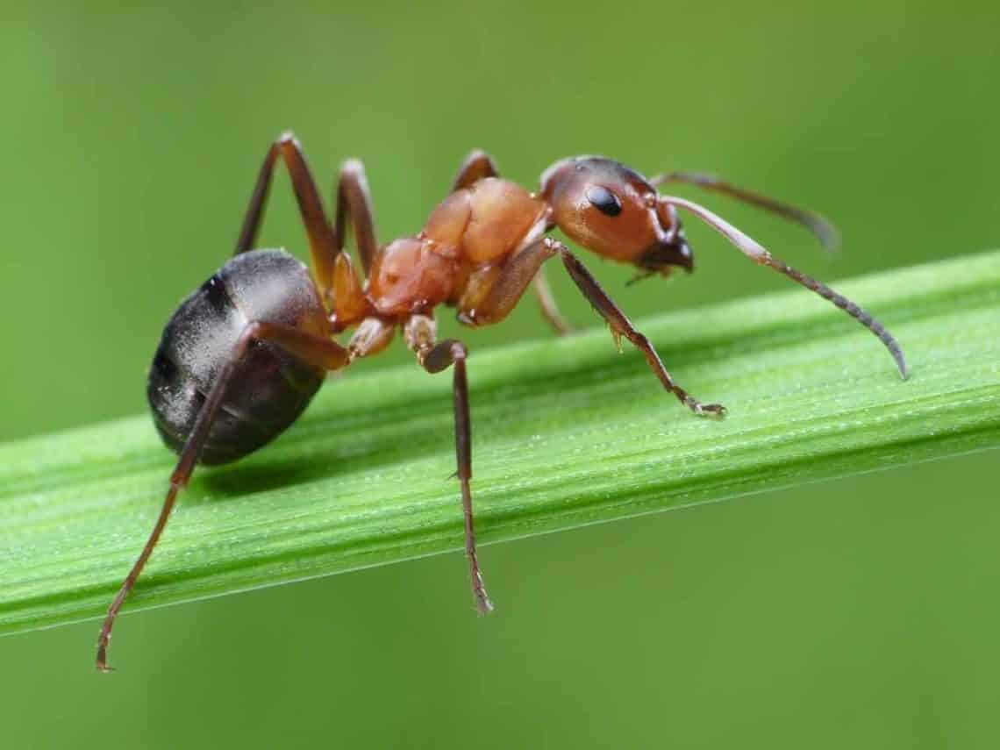

# Introducción


Localización

las hormigas

Las hormigas pertenecen a una sola familia que es la Formicidae, dentro de la superfamilia Vespoidea (@res1993phylogeny). Forman parte de un grupo de himenópteros sociales muy diversos, tanto taxonómica como funcionalmente (@fernandez2001hormigas). Las hormigas, dentro del grupo de los insectos, se considera como uno de los grupos más evolucionados por el nivel social y por el grado de especialización y dependencia que estas pueden alcanzar (@reyeshormigas). 

Distribución de las hormigas

Las hormigas representan una de las familias dominantes en cualquier ecosistema (@reyeshormigas).

Hormigas en la isla

En la isla La Hispaniola se conocen 43 géneros y 147 especies y subespecies de hormigas @Antwiki.

Hormigas en el campus de la UASD

No se tiene una publicación que identifique las especies de hormigas que se encuentran dentro del campus.

El objeto general y especificos.



# Metodología

\ldots

# Resultados

tablas y gráficos

```{r}

```

| hola 	| adios 	| 1 	| 2 	| 3 	| 4 	|
|:----:	|:-----:	|:-:	|:-:	|:-:	|:-:	|
|      	|       	|   	|   	|   	|   	|
|      	|       	|   	|   	|   	|   	|
|      	|       	|   	|   	|   	|   	|

# Discusión

conclusión

# Agradecimientos

# Información de soporte

\ldots

# *Script* reproducible

\ldots

# Referencias
