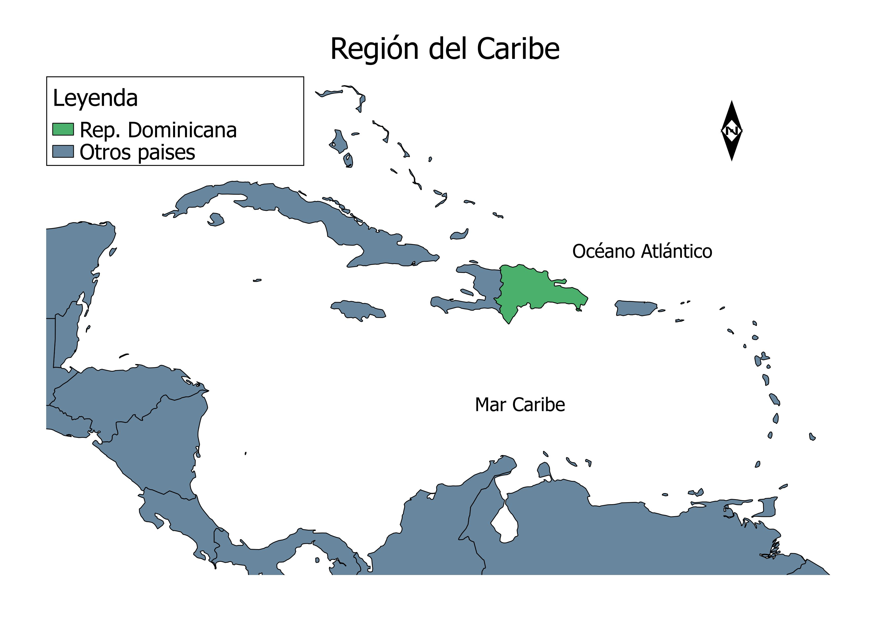
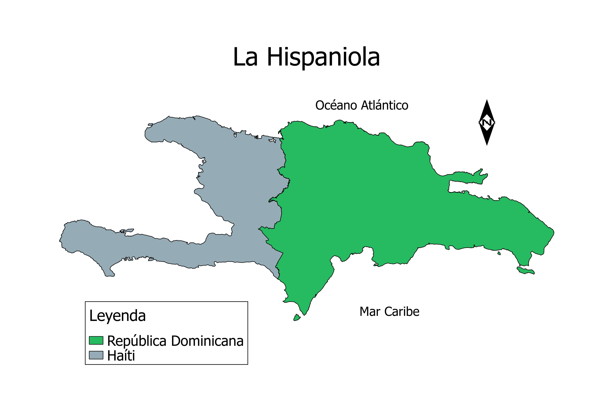
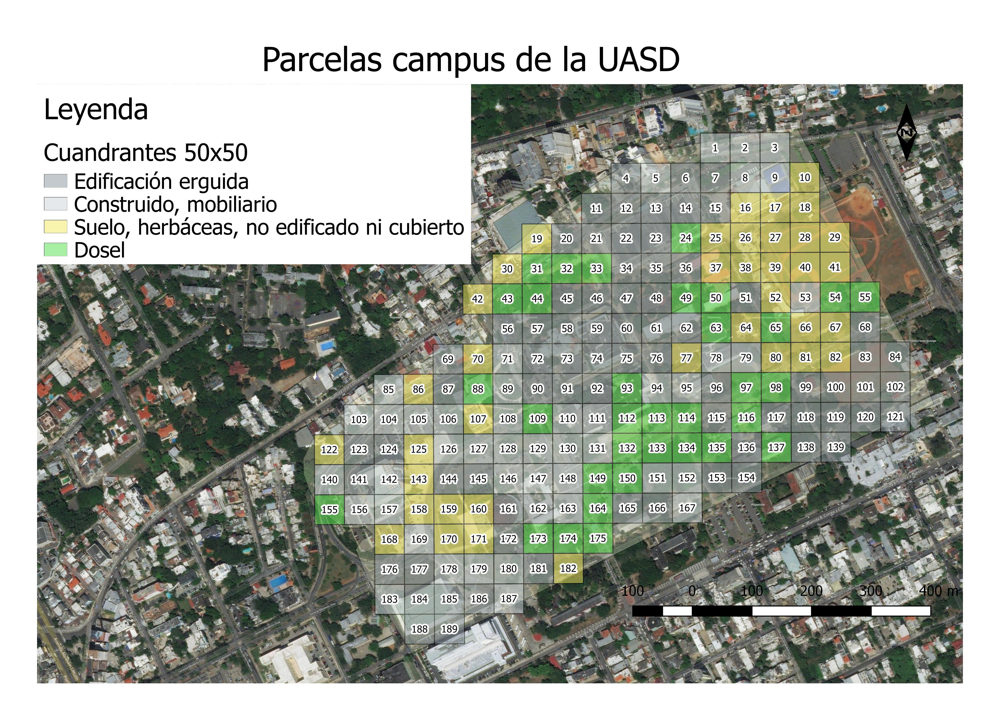
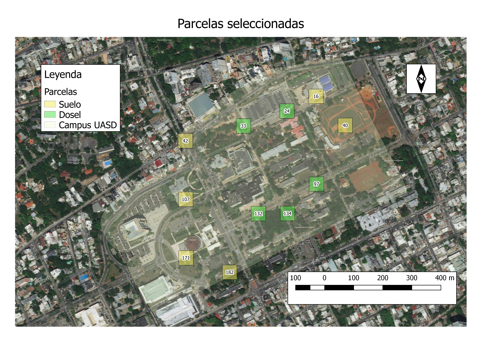

```{r setup, include=FALSE}
knitr::opts_chunk$set(
  collapse=TRUE,
  eval = T,
  warning=F,
  message=F
)
```
--- 

 

# Introducción

La Republica Dominicana está localizada en la isla La Hispaniola, en la región del Caribe (figure 2), formando parte del arco de las denominadas Antillas Mayores. Ocupa las dos terceras partes del este de la isla, la cual comparte con la República de Haíti (figure 3). El campus de la Universidad Autónoma de Santo Domingo (UASD) se encuentra en la ciudad de Santo Domingo, República Dominicana. 

 



Las hormigas pertenecen a una sola familia que es la Formicidae, dentro de la superfamilia Vespoidea (@res1993phylogeny). Forman parte de un grupo de himenópteros sociales muy diversos, tanto taxonómica como funcionalmente (@fernandez2001hormigas). Las hormigas, dentro del grupo de los insectos, se considera como uno de los grupos más evolucionados por el nivel social y por el grado de especialización y dependencia que estas pueden alcanzar (@reyeshormigas). 

Las hormigas representan una de las familias dominantes en cualquier ecosistema (@reyeshormigas). En la isla La Hispaniola se conocen 43 géneros y 147 especies y subespecies de hormigas @Antwiki. No se tiene una publicación que identifique las especies de hormigas que se encuentran dentro del campus de la UASD, ni cómo estas se encuentran distribuidas. 

Lo que se busca lograr con este informe es establecer patrones en la distribución de las hormigas en el campus de la UASD, específicamente para suelo y dosel. Cuando se habla de suelo en este informe hace referencia al suelo desnudo o cubierto de grama, que no presenta construcciones de ningún tipo, y que se encuentra bajo cielo despejado. Mientras que cuando se habla de dosel hace referencia a suelos desnudos, cubiertos de gramas, hojarascas o rocas, pero que estan bajo arboles.Para analizar la similitud existente entre las parcelas se utilizara un dendrograma, que es una representación gráfica o diagrama de datos en forma de árbol, que se van dividiendo en subcategorías.

# Metodología

El campus de la UASD fue dividido en cuadriculas de 50m x 50m, formando 189 parcelas. A estas parcelas les fue asignado un tipo de suelo, dependiendo de cual fuera el más abarcador en el área, estas asignaciones podían ser: edificación erguida, construido, suelo y dosel (figure 4). De estas parcelas se seleccionaron, siguiendo un muestreo estratificado-aleatorio, 11 de suelo y 10 de dosel. Para realizar el muestreo se tomaron 6 de las 11 de suelo y 5 de las 10 de dosel (figure 5), para un total de 11 parcelas muestreadas.





Para iniciar la colecta de hormigas era necesario una lista de materiales, entre ellos: 

-ODk Collect: es una aplicación para Android que reemplaza los formularios en papel. Se utilizó para recolectar los datos de comunidad y ambientales de las parcelas. El formulario llenado fue el de nombre 'Hormigas UASD HABITAT'.

-Frascos para conservar las hormigas.

-Alcohol etílico al 70%.

-Pincel para la recolección de hormigas.

-Cinta adhesiva blanca para poner los nombres en las muestras y transparente para cubrirlos.

-Chinógrafo para escribir los códigos.

-En algunos casos, en los cuales era necesario, se utilizó la luz del celular.

Una vez se tenían las parcelas identificadas y todos los materiales necesarios se inició con la recolecta de hormigas. Se hacía una cuadricula de 4x4 separa a unos 2 metros cada punto, en los cuales se ponían los cebos (16 cebos por cada parcela); en este caso los cebos de todas las parcelas fueron iguales, atún en aceite vegetal. Se dejaban unos 30 minutos para que las hormigas llegaran, mientras tanto se llenaba el formulario de ODK Collect. 

Una vez pasados los 30 minutos se iniciaba a recolectar las hormigas, para lo cual se tomaban del cebo con el pincel y se llevaban a los frascos llenos de alcohol etílico. Este frasco era identificado con un código único, el cual también era el código registrado en el ODk Collect. Todos los individuos encontrado en la misma parcela se depositaban en un mismo frasco.

Luego de recoger las 11 muestras se identificaron utilizando una lupa electrónica y un formulario de identificación que se encuentra en @Antwiki.

# Resultados

## Carga de funciones y paquetes

```{r}
library(tidyverse)
library(knitr)
library(sf)
library(vegan)
library(ade4)
library(FactoMineR)
library(readr)
source('src/funciones_analisis.R')
```

## Hormigas encontradas en el campus de la UASD.

| Subfamilia       |      Género      |
|----------------  |:----------------:|
| Myrmicinae       | Cardiocondyla sp |
|                  |   Monomorium sp  |
|                  |    Pheidole sp   |
|                  |   Solenopsis s   |
|                  |  Tetramorium sp  |
|                  |   Wasmannia sp   |
| Formicinae       | Brachymyrmex sp, |
|                  |  Paratrechina sp |
| Dolichoderinae   |   Dorymyrmex sp  |
| Pseudomyrmecinae |  Pseudomyrmex sp |

-Género en suelo = 7

-Género en dosel = 10


## Tablas y gráficos

```{r, warning=F, message=F}
todos_los_habitat <- read.csv('export/tabla_todos_los_habitat.csv')
todos_los_nidos <- read.csv('export/tabla_todos_los_nidos.csv')
mcpooledhabitat <- read.csv('export/mc_pooled_habitat.csv', row.names = 1)
mcpoolednidos <- read.csv('export/mc_pooled_nidos.csv', row.names = 1)
nomlat <- read_csv('equivalencia_etiqueta_nombre_latino.csv')
```

```{r}
mcemdilone <- matriz_comunidad_hab('emdilone')
maemdilone <- matriz_ambiental_hab('emdilone')
maemdilone <- maemdilone[match(rownames(mcemdilone), rownames(maemdilone)),]
```

## Análisis exploratorios básicos:

Matriz de Comunidad 

```{r}
mcemdilone %>% kable
```

Matriz ambiental

```{r}
maemdilone %>% kable
```


Número de géneros por parcela

```{r}
mcemdilone %>% specnumber %>% sort %>% kable
```

Número de parcelas según conteo de género

```{r}
mcemdilone %>% rowSums %>% table %>% kable
```

Número de parcelas en las que aparece cada género

```{r}
mcemdilone %>% colSums %>% sort %>% kable
```

Número de parcelas en las que aparece cada genero, por tipo de parcela

| Especie          | Suelo     | Dosel     |
|------------------|:---------:|:---------:|
| Brachymyrmex sp  |     3     |     4     |
| Cardiocondyla sp |     1     |     3     |
| Dorymyrmex sp    |     5     |     3     |
| Monomorium sp    |     1     |     1     |
| Paratrechina sp  |     1     |     1     |
| Pheidole sp      |     2     |     5     |
| Pseudomyrmex sp  |     0     |     1     |
| Solenopsis sp    |     4     |     3     |
| Tetramorium sp   |     0     |     2     |
| Wasmannia sp     |     0     |     1     |

## Curva de acumulación de especies:

```{r curva_acumulacion_emdilone}
mcemdilone_sac <- specaccum(mcemdilone)
plot(mcemdilone_sac, ci.type="polygon", ci.col="yellow")  
```

## Ordenación: dendrograma y PCoA

Generar matrices de comunidad y ambiental para ordenación:

```{r}
mcem_ord <- mc_para_ord(filtusuario = 'emdilone')
mcem_ord %>% kable
maem_ord <- ma_para_ord(filtusuario = 'emdilone', mc = mcem_ord)
maem_ord %>% kable
```

### Dendrograma

```{r dendro_emdilone}
dendro(mc = mcem_ord, k = 4)
```

*Grupo 1


```{r}
mcemdilone[c('p40'),] %>% kable
```

La parcela 40 se encontró un solo género, Solenopsis.


*Grupo 2

```{r}
mcemdilone[c('p182', 'p97'),] %>% kable
```

En las parcelas 182 y 97 se encontraron 3 géneros, de los cuales tienen 2 en común, Monomorium y Pheidole.


*Grupo 3

```{r}
mcemdilone[c('p16', 'p171', 'p42'),] %>% kable
```

En las parcelas 16, 171 y 42 están presente Brachymyrmex y Dorymyrmex.


*Grupo 4

```{r}
mcemdilone[c('p132', 'p24', 'p134', 'p107', 'p33'),] %>% kable
```

En las parcelas 132, 24, 134, 107 y 33 tienen en común a Pheidole.

### PCoA:

```{r pcoa_emdilone, out.width=1500}
pcoa_em <- pcoagg(mc = mcem_ord, ma = maem_ord, distmethod = 'gower', textoetiq = 2, p_max = 0.2)
pcoa_em['grafico']
```

# Discusión

En las 11 parcelas muestreadas se encontraron 10 géneros de hormigas. En suelo se encontraron 7 de los 10 y en dosel los 10 en total. La más común fue Dorymyrmex sp, la cual se encontró en 8 de las 11 parcelas, seguida por Solenopsis sp, Pheidole sp. y Brachymyrmex sp, las cuales aparecen en 7 de las 11 parcelas. Las menos comunes fueron Pseudomyrmex y Wasmania, solo se encontraron en 1 de las 11 parcelas.

Pseudomyrmex sp, Tetramorium sp y Wasmannia sp fueron encontradas solo en parcelas de dosel. Pseudomyrmex es una hormiga arbórea, por lo cual no es común encontrarla en cebos; lo que se estima es que, ya que, el cebo se encontraba colocado bojo cobertura de arboles, la misma cayó desde el arbol durante la muestra, lo que no se explica es si fue coincidencia o si la misma se sintió atraida por el cebo. En el caso de Wasmania, se trata de una hormiga muy pequeña, y por tanto, dificil de recolectar. Tetramorium sp suele encontrarse en las hojarascas y el dosel, esto explicaría porque solo apareció en dosel.

Monomorium sp y Paratrechina sp no presentan un patron en su distribución, ya que ambas se encuentran presente en una parcela de dosel y en una parcela de suelo. Solenopsis sp tampoco presenta un patron en su comportamiento, esta presente en 4/6 parcelas de suelo y en 3/5 parcelas de dosel. Brachymyrmex sp también está bien distribuida, en 3 parcelas de suelo y 4 de dosel.

Cardiocondyla sp estuvo más presente en dosel, con aparición en 3 parcelas, y una sola de suelo. Por otro lado Dorymyrmex sp estuvo más presente en las muetras de suelo, 5 parcelas, que en las de dosel, 3 parcelas.

Pheidole sp tuvo un comportamiento bien marcado, en primer lugar estuvo presente en todas las parcelas de dosel, y solo en 2 de suelo. En segundo lugar se puede observar que en las 2 parcelas que estuvo presente en suelo, fueron colectadas después de las 4:00 pm, una hora en la cual el suelo de las parcelas muestreadas se encontraba bajo sombra, lo que nos indica que este género puede verse afectado por la temperatura del suelo.

Tomando en cuenta el dendrograma se puede observar que:

*El grupo que presenta mayor diferencia es el 1, que esta formado por la parcela 40, en la cual solo en 3 de los 16 cebos se encontraron hormigas, y es la única que presenta un solo género. Esta muestra fue recolectada en el area del play sobre grama y cerca a las 12 del medio dia. Por esto se pueden estimar diferentes factores que afecten en la recolecta, como es el instrumento que se utiliza para recortar la grama, el horario tan caliente a la cual se recolectó y el que muchas personas transitan el area a los horarios de practica.  

*El grupo 2, que esta formado por las parcelas 182 y 97, presentan 2 géneros en común, que son Monomorium y Pheidole, esto a pesar de que la 182 fue recolectada en suelo y la 97 en dosel. La parcela 97 tambien se encontró Brachymyrmex, y en la parcela 182 Dorymyrmex.

*En el grupo 3, que esta compuesto de las parcelas 16, 42 y 171, se puede observar que presentan 2 géneros en común, que son Brachymyrmex y Dorymyrmex. Las parcelas 171 y 42 tambien tienen en común a Solenopsis. Las 3 parcelas pertenecen a suelo.

*En el grupo 4, que esta compuetso por las parcelas 132, 24, 134, 107, 33, se presentan 1 solo género en común, el cual es Pheidole. La mayor similitud se da en dos casos: 
1- Parcelas 24 y 33, las cuales cuentan con 4 géneros en comun, que son Brachymyrmex, Cardiocondyla, Dorymyrmex, Pheidole; ambas parcelas pertenecen a dosel. 
2-Parcelas 107 y 33, las cuales tambien tienen 4 géneros en común, los cuales son: Cardiocondyla, Dorymyrmex, Pheidole, Solenopsis; a diferencia de las parcelas 24 y 33, estas pertenecen a tipos diferentes, la parcela 33 pertenece a dosel y la 107 a suelo.

Si analizamos la distribución a partir de los datos obtenidos por el dendrograma podremos llegar a la siguiente conclusión, el tipo de suelo no limita la distribución de las hormigas que son atraídas por el cebo. Se puede observar en el grupo 2 que Monomorium y Pheidole pueden convivir en dosel y suelo. En el grupo 3 se observa que Brachymyrmex y Dorymyrmex conviven en suelo, pero luego encontramos en el grupo 4 que ambos generos conviven en la parcela 24 y 33 que pertenecen a dosel. También se puede ver que para ser similar no es necesario estar en el mismo tipo de parcela, ya que 107 y 33 presentan un alto nivel de similitud y pertenecen a tipos diferentes. 

# Referencias
